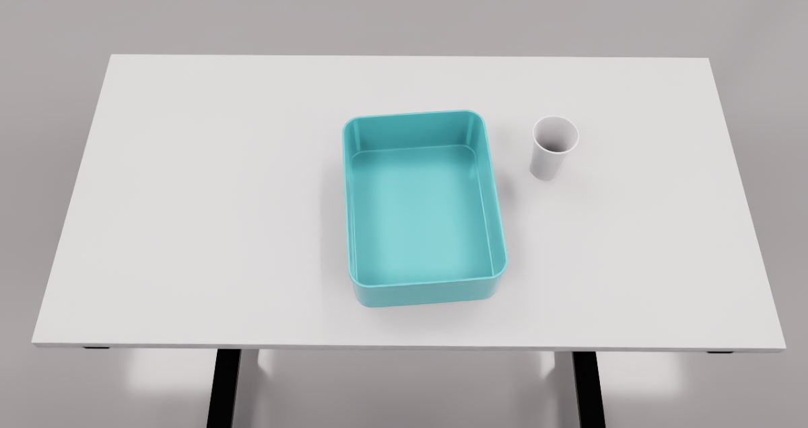
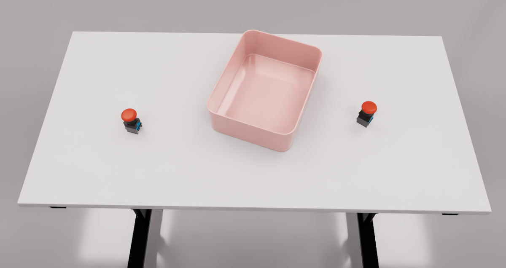
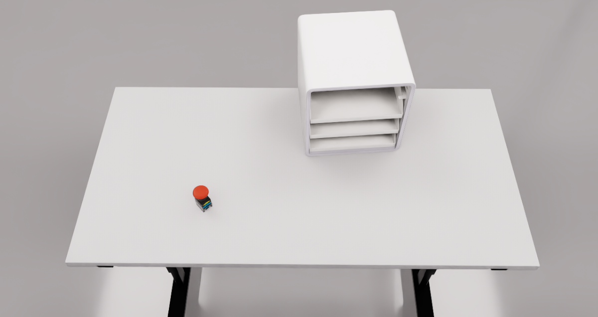

# Benchmark Usage Instructions
  - This version is compatible with Isaac-Sim 4.5
## Installation
1. **Install Isaac Sim 4.5**  
   - Official Documentation: [https://docs.isaacsim.omniverse.nvidia.com/4.5.0/installation/download.html](https://docs.isaacsim.omniverse.nvidia.com/4.5.0/installation/download.html)
   - Linux Version Download: [https://download.isaacsim.omniverse.nvidia.com/isaac-sim-standalone-4.5.0-linux-x86_64.zip](https://download.isaacsim.omniverse.nvidia.com/isaac-sim-standalone-4.5.0-linux-x86_64.zip)
   - Installation steps:
  
   ```bash
   # Create installation directory
   mkdir ~/isaacsim_4.5
   
   # Unzip package (assuming downloaded to ~/Downloads)
   cd ~/Downloads
   unzip "isaac-sim-standalone-4.5.0-linux-x86_64.zip" -d ~/isaacsim_4.5
   
   # Run post-installation setup
   cd ~/isaacsim_4.5
   ./post_install.sh
   
   # Launch Isaac Sim
   ./isaac-sim.selector.sh
   ```
2. **Install required packages**  
    ```bash
    ~/isaacsim_4.5/python.sh -m pip install -r benchmark/requirements.txt
    ```

## Configuration

Edit `benchmark/common/isaac_config.toml` file:

```toml
[isaac_sim]
# Your Isaac Sim Python path, for example
python_path = "~/isaacsim_4.5/python.sh"
```

## How to Start
### Start Inference
Run [benchmark/tools/policy_infer.py](./tools/policy_infer.py) first. 

```bash
python3 benchmark/tools/policy_infer.py
```
  - The script only provides interfaces for interacting with the simulation, and model inference needs to be implemented by the user themselves !

### Start Sim Benchmark
Then run Isaac Sim

#### Batch
```bash
# TienKung task
~/isaacsim_4.5/python.sh benchmark/benchmark.py --task TienKung_task_01 --loop 3 --timeout 300
```

#### Single
```bash
# TienKung task
~/isaacsim_4.5/python.sh benchmark/tasks/run_task.py  --task TienKung_task_01 --usd ABSOLUTE_PATH_TO_USD_FILE
```

#### Arguments Description

  - `--loop` is the number of tests, with a default value of 1

  - `--timeout` is the maximum duration for a single test, with a default of 300 seconds

  - `--task` is the name of the evaluation task

    | --task | Robot |<div style="width:200px">Task description</div>|Hdf5 links (collected in isaacsim4.5)| Example scenario |
    |:------:|:-----:|----------------|:----:|:----------------:|
    | TienKung_task_01 |TienKung2.0| Put the paper cup into the basket with right arm |<div style="width:100px">[121-right_arm_put_paper_cup_into_box](https://modelscope.cn/datasets/X-Humanoid/RoboMIND2.0-Tienkung-sim/tree/master/data/tienkung_sim/121-right_arm_put_paper_cup_into_box/success_episodes)</div>||
    | TienKung_task_02 |TienKung2.0| Rotate the pan handle, from 6 o'clock to 9 o'clock direction |<div style="width:100px">[122-rotate_pot_handle](https://modelscope.cn/datasets/X-Humanoid/RoboMIND2.0-Tienkung-sim/tree/master/data/tienkung_sim/122-rotate_pot_handle/success_episodes)<dev>||
    | TienKung_task_03 |TienKung2.0| Organize the desktop, use left and right robotic arms to put the industrial switch objects on the desktop into the basket |<div style="width:100px">[103-put_switch_on_desktop_into_basket](https://modelscope.cn/datasets/X-Humanoid/RoboMIND2.0-Tienkung-sim/tree/master/data/tienkung_sim/103-put_switch_on_desktop_into_basket/success_episodes)<dev>||
    | TienKung_task_04 |TienKung2.0| Right arm pulls out the shelf, left arm puts the button on the shelf, right arm pushes the shelf back |<div style="width:100px">[115-places_switch_on_shelf](https://modelscope.cn/datasets/X-Humanoid/RoboMIND2.0-Tienkung-sim/tree/master/data/tienkung_sim/115-right_arm_pulls_out_storage_shelf_and_left_arm_places_switch_on_shelf_and_right_arm_closes_shelf/success_episodes)<dev>||

#### Note
  - The currently open-sourced sim hdf5 data was collected in IsaacSim 4.5, and the sim data collected in IsaacSim 5.1 will be open-sourced in the future
  - Simulation run logs and evaluation results paths: `benchmark/logs`
  - Each task provides 50 scenarios, and each time the simulation is initiated, one will be randomly selected

